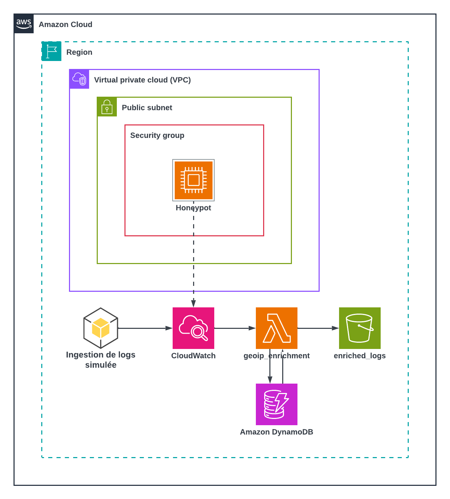

# Phase 1 — Validation locale (LocalStack)

## Objectif

Valider l'intégralité du pipeline de traitement des logs (capture,
enrichissement GeoIP, stockage) avant tout déploiement sur un vrai compte
AWS, sans dépenser un centime ni risquer de mauvaise configuration
réseau/IAM en conditions réelles.

## Schéma d'architecture

##  Point essentiel : les logs ne viennent pas d'une vraie instance

LocalStack Community (la version gratuite) **n'émule pas une vraie VM**.
Une ressource `aws_instance` y est simulée uniquement au niveau de l'API
**aucun système
d'exploitation ne démarre réellement**. Le honeypot Cowrie ne tourne donc
pas en local.

Le bloc **"Ingestion de logs simulée"** sur le schéma représente donc
`log_generator.py` : un script Python qui écrit directement dans
CloudWatch Logs via `boto3` (`put_log_events`), en imitant le format
exact des événements que produirait un vrai Cowrie. Le honeypot
(cadre "Honeypot" dans le VPC) est présent dans le schéma pour la
cohérence de l'architecture cible, mais **il n'émet rien lui-même dans ce
test** — la flèche en pointillés vers CloudWatch symbolise ce chemin
prévu, pas ce qui est réellement exécuté en Phase 1.

### Méthode de génération de logs choisie

Plutôt que de tenter de faire tourner un vrai conteneur Cowrie (impossible
sur LocalStack Community), le choix a été d'injecter des logs
**structurellement identiques** à ceux de Cowrie directement dans
CloudWatch. Ça permet de valider tout ce qui se passe **après** la
capture.

## Le cache GeoIP à deux niveaux

Chaque IP source doit être géolocalisée via un appel à une API externe
(ip-api.com). Sans cache, une IP qui revient plusieurs fois déclencherait
un appel API redondant à chaque fois. Ne sachant pas dutout à quel traffic m'attendre une fois l'honeypot déployé en production, j'ai fais le choix de mettre en place un cache à 2 niveaux pour éviter au maximum les échanges inutlies.

- **Niveau 1 (mémoire)** : un dictionnaire Python local, valable
  uniquement pendant l'exécution d'une invocation Lambda. Évite les
  appels redondants quand plusieurs logs du même lot concernent la même
  IP.
- **Niveau 2 (DynamoDB)** : une table avec un TTL court (60 secondes lors
  des tests, 300 par défaut), qui persiste **entre** deux invocations
  Lambda séparées. La Lambda vérifie elle-même le champ `expires_at`
  avant d'utiliser une entrée, plutôt que de se fier uniquement à la
  suppression automatique DynamoDB (qui n'est pas instantanée).

## Contraintes rencontrées

Deux limites propres à LocalStack Community ont façonné cette phase (voir
`CONTRAINTES.md` à la racine du projet pour le détail complet) :

1. **Pas de vraie EC2** (expliqué ci-dessus) → d'où le recours à
   `log_generator.py` plutôt qu'à un vrai Cowrie.
2. **Pas d'Athena** (réservé à l'offre Pro de
   LocalStack) → l'étape d'analyse SQL n'est donc pas présente dans cette
   phase, elle ne sera testée qu'au déploiement AWS réel (Phase 2).

## Limites éventuelles à l'échelle et comment les parer

- **ip-api.com** (l'API de géolocalisation utilisée) limite gratuitement
  à 45 requêtes par minute. Le cache réduit fortement les appels sur les
  IP déjà vues, mais un afflux de nombreuses IP *différentes* en peu de
  temps peut quand même dépasser ce seuil. Dans ce cas, l'enrichissement
  retombe simplement sur `"Unknown"` sans faire planter le pipeline —
  dégradé, mais pas cassé. Parade possible si le volume grossit vraiment :
  passer sur un plan payant avec clé API, ou un fournisseur avec un quota
  plus large.
- **Concurrence Lambda plafonnée à 10** (`reserved_concurrent_executions`) :
  volontaire, pour éviter qu'un pic de logs ne consomme toute la
  concurrence Lambda du compte AWS (un pool partagé avec toutes les
  autres fonctions du compte, pas dédié à celle-ci). Si ce plafond est
  atteint, les invocations en trop ne sont pas perdues immédiatement :
  CloudWatch les retente automatiquement, tant que la surcharge ne dure
  pas trop longtemps.

## Résultats obtenus et ce qu'ils prouvent

Le fichier [`fonctionnement_ETL`](fonctionnement_ETL)
contient la sortie complète d'une exécution du scénario de test dédié au
cache (`run_cache_test_scenario()` dans `log_generator.py`), en 3 vagues :

| Vague | Ce qui est envoyé | Résultat observé | Ce que ça prouve |
|---|---|---|---|
| 1 | 5 logs, IP jamais vue | `[CACHE MISS]` puis 4x `[CACHE HIT][L1-memoire]` | Le cache mémoire (L1) évite bien les appels redondants au sein d'une même invocation |
| 2 (15s après) | 5 logs, même IP | `[CACHE HIT][L2-dynamodb]` puis 4x `[CACHE HIT][L1-memoire]` | Le cache DynamoDB (L2) persiste bien **entre deux invocations Lambda séparées**, dans la fenêtre du TTL |
| 3 (après expiration du TTL) | 5 logs, même IP | Un nouveau cycle miss/hit | Le TTL est correctement respecté : l'entrée expirée n'est plus réutilisée |

Chaque vague produit un fichier JSON dans le bucket `honeypot-enriched-logs`
(visible dans le log de preuve), contenant les événements enrichis avec un
champ `geoip` complet (`country`, `latitude`, `longitude`), confirmant que
le pipeline complet — capture, désérialisation, enrichissement, cache,
écriture S3 — fonctionne de bout en bout.

## Fichiers de cette phase

- [`main.tf`](main.tf) — infrastructure Terraform ciblant LocalStack
- [`log_generator.py`](log_generator.py) — générateur de logs simulés + scénario de test du cache
- [`Guide_Lancement.md`](Guide_Lancement.md.md) — déroulé complet pour reproduire ces tests
- [`Enriched_Logs_Content`](Enriched_Logs_Content/) — contenu des logs enrichis par la fonction lambda
- [`Lambda_Logs`](Lambda_Logs/) — contenu des logs crées par la lambda lors des test
