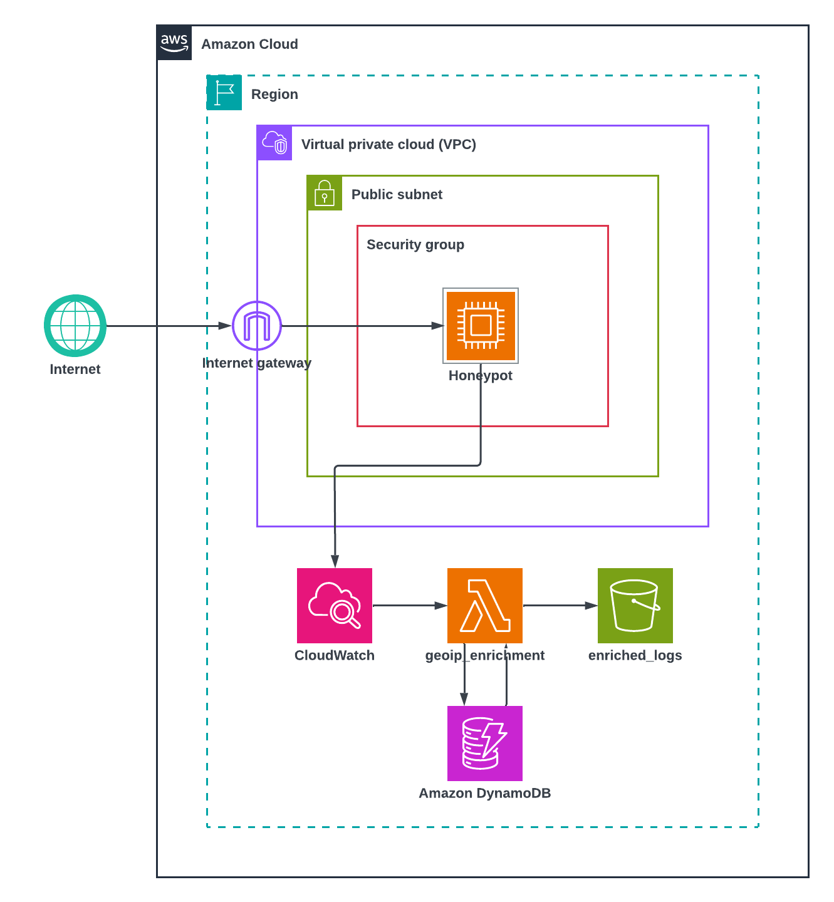
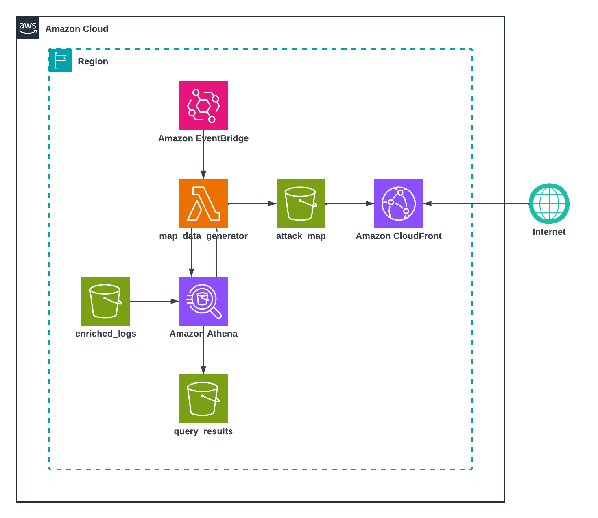

# Phase 2 — Production fermée (AWS réel)

## Objectif

Déployer le honeypot sur une vraie instance AWS, accessible uniquement
depuis mon IP personnelle, pour valider que tout le pipeline (capture →
enrichissement → stockage → analyse → visualisation) fonctionne
réellement de bout en bout, avant d'envisager une ouverture au trafic
public prévue dans la phase 3 du projet.

## Schémas d'architecture

**Capture et enrichissement des logs :**

Même fonctionnement que dans la partie 1, chaque événement Cowrie déclenche la Lambda d'enrichissement presque
immédiatement (subscription filter CloudWatch Logs → Lambda direct). Elle décode le texte, résout le pays (cache
DynamoDB ou API externe), et écrit un fichier JSON dans le bucket enrichi.

**Génération et affichage de la carte :**

Pour l'instant, le rafraîchissement des données est volontairement simple. \
Une règle EventBridge déclenche la lambda "map_data_generator" à chaque minute qui écrit les résultats dans le fichier data.json présent dans le bucket "attack_map". Le navigateur utilisateur redemande les données chaque minute et bénéficie donc directement des données fraîchement calculées.\
Sur la distribution CloudFront, le TTL est volontairement paramétré à 0s pour être sûr de bénéficier des dernières données disponibles. 

L'amélioration de la carte se fera dans la Partie 4.

## Sécurité mise en place

- **Security group restreint** à une seule IP personnelle
  (`admin_test_cidr`), avec une validation Terraform qui bloque
  explicitement `0.0.0.0/0`
- **Administration via AWS Systems Manager**, pas de vrai SSH admin — le
  port 22 est occupé par l'émulation Cowrie
- **Bucket de la carte entièrement privé**, accessible uniquement via
  CloudFront (Origin Access Control) — aucun accès public direct au S3
- **Aucune API publique exposée** — la carte ne fait que lire un fichier
  statique, pas d'endpoint qui accepterait une entrée du visiteur

## Connexion au honeypot

Cowrie est exposée sur le port 22 de l'instance EC2, on s'y connecte donc en ssh, c'est tout son intérêt.

La vidéo suivante montre que le pipeline ETL fonctionne parfaitement, ma localisation apparaît sur la carte, environ 1 minute après ma connexion sur l'instance. 

[▶️ Voir la vidéo](media/Intentional_attack.mov)

## Simulation d'attaques multiples

Dans la vidéo suivante, j'ai simulé plusieurs tentatives d'attaques du Honeypot grâce à un script python. Grâce à l'enrichissement géographique des données, on peut les afficher sur la carte interactive.

[▶️ Voir la vidéo](media/Attacks_simulation.mov)

## Ce que compte réellement la carte

Le compteur "interactions" et les points sur le globe ne comptent que les
événements `cowrie.command.input` (des commandes réellement tapées par
l'attaquant) — pas les connexions ou tentatives de login, qui gonfleraient
artificiellement le chiffre sans représenter une vraie action.

## Limites connues

Actuellement, le principe de traitement des données enrichies est loin d'être optimal, ça n'était pas l'objectif de cette Phase du projet.\
Il y a de nombreux problèmes que j'ai en tête, et j'ai plusieurs idées pour les résoudre. Nous verrons ça en détail dans la Phase 4, mais je vais faire un petit débrief ici. 

- **Principe de requêtage Athena non optimal :** actuellement, chaque refresh de la carte implique 4 scans de l'entièreté des logs présents dans le bucket S3 "enriched_logs".
C'est pour l'instant largement viable car je suis le seul à me connecter au honeypot et la quantité de logs générés est quasi nulle. 
En développement réel, la quantité de logs ne cessera de croître et d'une part, la facture Athena risque d'exploser, d'autre part les performances de l'interface seront directement impactées.

## Fichiers de cette phase

- [`main.tf`](main.tf) — infrastructure Terraform complète (réseau, EC2,
  pipeline, Athena)
- [`index.html`](index.html) — la page de la carte (globe
  interactif, panneau de stats)
- [`attack_simulator.py`](attack_simulator.py) — script de simulation
  d'attaques multi-continents pour tester le rendu de la carte avec plusieurs points
- [`media/`](media/) — schémas d'architecture et vidéos de démonstration
